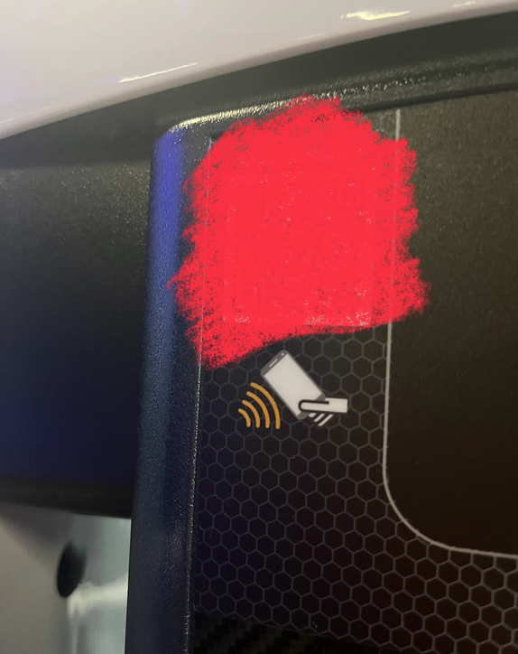
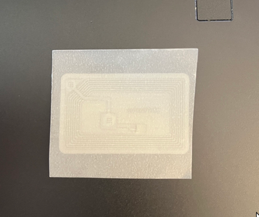
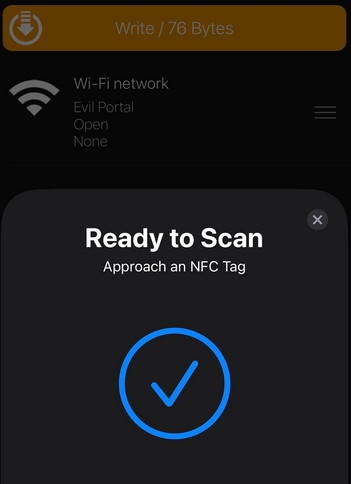
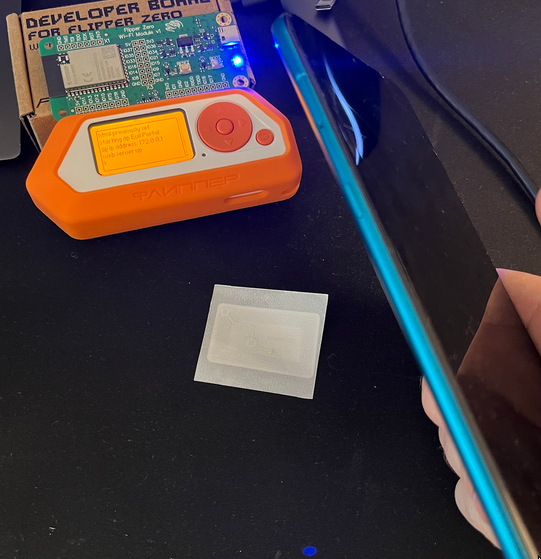
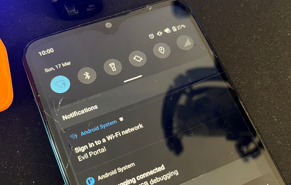
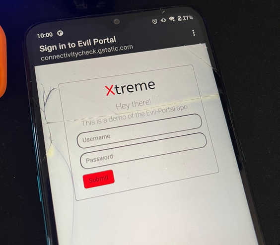

# Malicous NFC

## Disclaimer
This blog presents a hypothetical scenario for educational purposes only.

## Background
I went to a gym which had NFC tags on the exercise equipment. These NFC tags were intended to provide easy access to exercise instructions.

I was resting between my sets, and decided to scan the NFC tag using an app called "NFC Tools". It's a nifty tool that scans and provides information about NFC tags. To my own surprise, the NFC tag on this gym equipment was not password protected. This meant that anyone with a smart phone could re-program the NFC tag to point to a different website, for example.

This particular gym had multiple devices from the same manufacturer and they all had NFC tags, and the ones I scanned were not password protected. After I was done with my workout, I reported this to the gym staff and went on with my day.

## Assessing the Threat
After leaving the gym, I couldn't stop thinking about the unprotected NFC tags. I was thinking about scenarions what a malicious person could do with them.

I guess it depends on the situation. For example, if NFC/RFID tags e.g., keyfobs are used to open/close doors, and someone were to reprogram or wipe the tag, then the door would not operate. These types of Denial of Service attacks are possible, but the attacker would need to be in close proximity with the keyfob for a few seconds.

In this case, where the NFC tag is on gym equipment and points to a website, I'm not sure how much harm wiping the tag would actually do. I don't think these tags see too much action.

However, if the sticker was somewhere else, like in a cafe, hotel or an airport with a sign "Tap here for free Wi-Fi!", that could lead to problems.

## Evil Portal
I think the "free Wi-Fi!" situation is realistic. The attacker prints out a paper with an establishments logo and instructions to scan the NFC tag for free Wi-Fi and glues a NFC sticker on the paper. They then program the sticker to point to an evil portal application.

An evil portal is a malicious wireless network which attempts to trick users into connecting into it. After connecting, the network will  open a login page that mimics legimitate Wi-Fi networks that are found in cafes, airports, or hotels, and prompt the user to login using their social media credentials, for example, to connect to the network. If they are gullible enough, they will provide the credentials which are then logged on the attackers device.

## Proof of Concept
Just to see what this would look like, I got myself a few NFC stickers:  

I programmed the NFC sticker with my phone to prompt the reader device to connect to a Wi-Fi network (Evil Portal):  

Then I setup an evil portal on my Flipper Zero:  

Scanning the NFC tag with a phone:  

Which made the phone prompt to sign into the Wi-Fi network:  

Clicking the prompt opened the Evil Portal's test sites:  

And receiving the passed values on Flipper's end:  

## Effectiveness
Is this something to worry about? Yeah, I'd say so. I feel like using a NFC tag to connect to a public Wi-Fi network lowers the barrier. Tapping your phone on a sticker is much easier than going through settings to connect to the right network.

However, this "attack" seems to only works on Android devices. I was not able to scan the NFC tag with an iPhone when the tag was programmed with instructions to connect to a network. I guess to target Apple devices, the attacker would have to include instructions for the target to manually connect to the evil portal. This kind of defeats the purpose (I'm exploring NFC tag "vulnerabilities").

Ultimately this goes back to "do not connect to public Wi-Fi networks", but using NFC tag lowers the barrier. Imagine if you are in a restaurant waiting for your food and there's a paper saying "connect to our free Wi-Fi - tap your phone here!". I feel like many would do so.

The evil portal doesn't have to run on a Flipper Zero either - it can run on lightweight devices, such as ESP32 and Raspberry Pi. Attacker could have multiple devices in multiple locations, and since they are small, they can be hidden almost anywhere.

So while this method does have some "potential", it would require:
1. A printer (to print out the "Tap here for free Wi-Fi!" -instructions)
2. A device to host the evil portal on (ESP32, F0, Raspberry Pi...)
3. NFC tags
4. The target to use an Android phone
5. The target to be gullible

So is this possible? Absolutely. Is this effective? ¯\\_(ツ)_/¯

