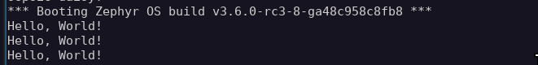
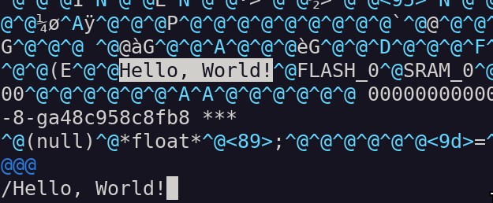
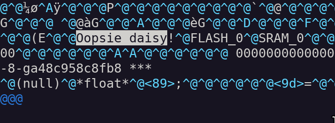
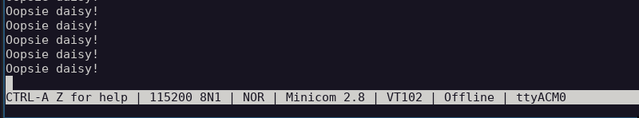

# Simple binary modification
This folder contains a simple application that prints `"Hello, World!"` once a second. The challenge is to dump, modify the printed string, and re-upload the firmware.

# Tools and environment
- App is built using zephyr
- nRF52840-dk
- J-Link (Other tools will most likely work as well)

# Pre-requisite
Install zephyr. Build and flash the software with:
```sh
$ cd [<path/to/your/zephyr/environment>]
$ west build -b nrf52840dk_nrf52840 [<path/to/this/folder>] --pristine
$ west flash
$ minicom -D /dev/tty[<nRF52840-dk device>]
```

# Challenge
1. Dump the firmware using an external tool
2. Change the printed string
3. Upload the firmware back on the board using an external tool

# Solution
1. view the serial communication using:
```sh
$ sudo minicom -D /dev/ttyACM0 -b 115200 # "Hello, World!" is printed once a second
```
  
2. Connect Segger J-Link to `Debug Out` on the nRF52840 board  
3. Connect to the device using:  
```sh
$ JLinkExe
J-Link> connect # Configure the device and connection parameters
J-Link> halt # Halt the CPU
```
4. Find the [memory map](https://infocenter.nordicsemi.com/index.jsp?topic=%2Fps_nrf52840%2Fmemory.html)   for the board from the internet
5. Dump the firmware using:  
```sh
J-Link> savebin dump.bin, 0x00000000, 0x00800000
```
6. Identify the string using:  
```sh
$ strings dump.bin |grep "Hello, World!" # If this doesn't return "Hello, World!" something went wrong.
```
7. Open the binary using your favorite editor and locate the `"Hello, World!"` string  
  
8. Modify the "Hello, World!" string. **Note!** The modified string's length must be equal to the original string's length (13 characters)!  
  
9. Load the modified binary using:  
```sh
J-Link> loadbin dump.bin, 0x00000000 # This may take a while
J-Link> go # Resume the program
```
10. Examine serial communication using `minicom`, verify the modified string is shown.
